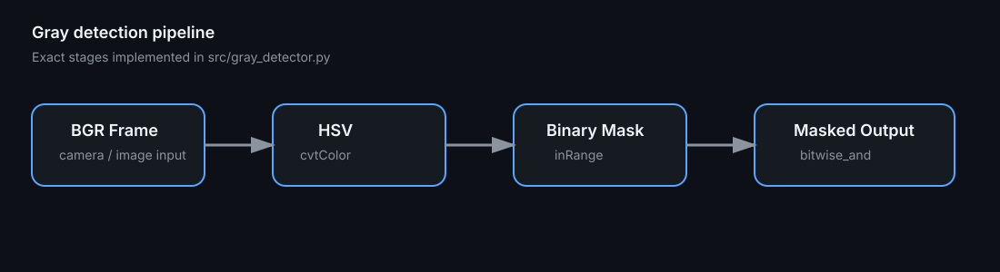

# Gray Detector — OpenCV HSV Segmentation Lab

[](https://github.com/syifaniads/GrayDetectorOpenCV/actions/workflows/python-ci.yml)

A small computer-vision lab that detects low-saturation gray regions from a live camera using **OpenCV**, HSV color-space thresholding, binary masking, and bitwise image composition.

The original 2025 coursework script is retained under [`historical/original_task.py`](historical/original_task.py). The current `src/` implementation is a portfolio refactor that makes the image-processing logic reusable, configurable, and testable without claiming that these engineering improvements existed in the original submission.

<p align="center">
  
</p>

> **Visual provenance:** this diagram maps the exact processing stages implemented in `src/gray_detector.py`. It is not a fabricated detection screenshot. A real camera output depends on the camera, illumination, and scene.

## Technical flow

```text
BGR camera frame
   ↓ cv2.cvtColor(..., COLOR_BGR2HSV)
HSV frame
   ↓ cv2.inRange(lower_hsv, upper_hsv)
binary gray mask
   ↓ cv2.bitwise_and(frame, frame, mask=mask)
masked detection output
```

The historical threshold was:

```python
lower_gray = (0, 0, 50)
upper_gray = (180, 50, 200)
```

This treats gray as **low saturation** (`S <= 50`) within a bounded brightness range (`50 <= V <= 200`). Hue is unrestricted because low-saturation pixels carry little useful hue information.

## Run

```bash
python -m venv .venv
# Windows: .venv\Scripts\activate
# Linux/macOS: source .venv/bin/activate
pip install -r requirements.txt
python -m src.gray_detector
```

Optional tuning:

```bash
python -m src.gray_detector --camera 0 --saturation-max 50 --value-min 50 --value-max 200
```

Press `q` or `Esc` to stop.

## Reusable API

```python
from src.gray_detector import GrayRange, detect_gray

mask, result = detect_gray(frame, GrayRange())
```

`detect_gray` is intentionally separated from webcam I/O so the segmentation logic can be tested with synthetic images or reused in another pipeline.

## Tests

The test suite uses generated pixel arrays instead of a physical webcam. It verifies that:

- mid-gray pixels fall inside the default HSV range;
- saturated red pixels are rejected;
- over-bright white pixels are rejected by the historical upper-value threshold;
- the bitwise result preserves only pixels selected by the mask.

```bash
pip install -r requirements-dev.txt
pytest -q
```

GitHub Actions runs the tests with `opencv-python-headless`, so CI does not require a GUI or camera.

## Engineering notes

HSV thresholding is deterministic and inexpensive, but it is sensitive to lighting and should not be confused with semantic object recognition. The default thresholds intentionally preserve the historical lab behavior rather than claiming they are universally optimal. For a production vision system I would calibrate thresholds from representative samples, evaluate precision/recall, consider morphology/noise filtering, and version the capture conditions.

## Repository map

```text
.
├── src/gray_detector.py
├── tests/test_gray_detector.py
├── historical/original_task.py
├── docs/assets/pipeline.svg
├── requirements.txt
├── requirements-dev.txt
└── .github/workflows/python-ci.yml
```

## Scope

This is a focused OpenCV learning project, not a face-recognition system and not a trained ML model. The repository demonstrates color-space conversion, threshold segmentation, masks, bitwise operations, camera handling, testability, and basic CI.
